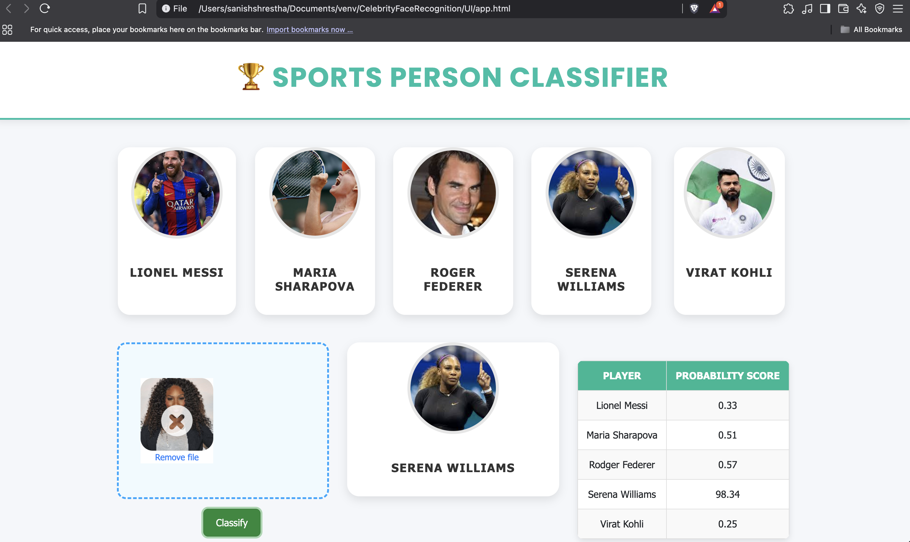

# 🏅 Sports Person Classifier

**Face Recognition of Top Athletes using Machine Learning**  
⚡ Powered by Python · Flask · Scikit-learn · Web Tech · Passion for Sports

---

Welcome to the **Sports Person Classifier** – a smart and sleek web application that uses machine learning to identify some of the greatest athletes on the planet just from their **face**!

### 👥 Recognized Legends:
- ⚽ **Lionel Messi**
- 🎾 **Roger Federer**
- 🎾 **Serena Williams**
- 🎾 **Maria Sharapova**
- 🏏 **Virat Kohli**

Just upload a picture, and boom 💥 — your sports legend is recognized in a flash!

---

## 🔍 How It Works

🧠 Behind the scenes:

1. **Data Collection & Preprocessing** – Face images were collected and cleaned.
2. **Model Training** – A classification model was trained using `Scikit-learn` and relevant face recognition features.
3. **Web Integration** – Built using `Flask` for the backend and `HTML/CSS/JS` for a snappy frontend.
4. **Prediction** – The model returns the name of the detected sportsperson with confidence.

---

## 🌐 Tech Stack

| Layer        | Tools Used                       |
|--------------|----------------------------------|
| ML Model     | Python, Pandas, Scikit-learn     |
| Web Server   | Flask                            |
| Frontend     | HTML5, CSS3, JavaScript          |
| Styling      | Custom styles with sports vibes  |

---

## 🖥️ Screenshot

Here's a glimpse of the app in action 👇



---

## 🚀 How to Run  
1️⃣ Clone the repo:  
```bash
git clone https://github.com/SanishCodes/Banglore-Home-Price-Prediction.git
cd Banglore-Home-Price-Prediction
```

2️⃣ Install Dependencies
```bash
pip install -r requirements.txt
```

3️⃣ Run the Flask Server
```bash
python server.py
```

4️⃣ Open the Web App
```bash
- Open app.html in your browser.
- Enter the required details to predict house prices in Bengaluru.
```


## 🤝 Contributing
Feel free to fork this repo, create a pull request, or open an issue!

🚀 Happy coding!
